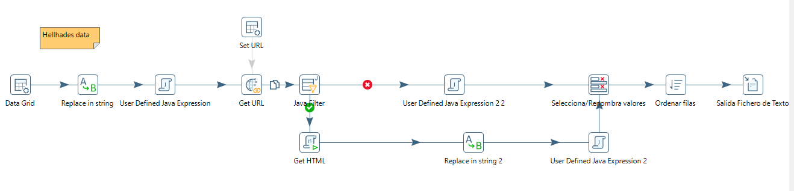

## Data Raid Tool [Abandoned]
App creada con la intención de consultar datos de distintas fuentes del juego Raid Shadow Legends de mobil.

El resultado lo podéis obtener deployando el proyecto maven y haciendo correr las transformaciones de kettle para obtener los datos de las fuentes.

## Triangulis del asunto

- Csv para la persistencia.
- JavaFx front-end.
- OpenCV para comparar imagenes.
- Spoon (Kettle) para hacer phishing de distintas webs para generar el contenido.

## Descripción y uso

Marzo 2021, Raid Shadow legends identifica a los campeones por imagen.

Cada campeón tiene unas caracteristicas. Que aplicaciones de terceros han detallado bajo su criterio.

- [Ctrl + A] captura una region donde se hace mouse over para comparar esa region con la bateria de imagenes.
- Al acabar el proceso muestra las caracteristicas del campeón que ha hecho match. (La imagen muestra, el campeón que se busca dónde esta el puntero del ratón).

La información se obtiene con las distintas transformaciones de kettle (ejemplo de obtener datos de la página https://hellhades.com/).

Steps
----
1) Dado un listado de campeones.
2) Navega a una url contruida a través del nombre de campeón.
3) Obtiene la información con una simple función javascript (buscando por el dom).
4) Genera un fichero csv.

## ¿Que mejoraria?
- Optimizaria el algoritmo de búsqueda de imagenes similares.
- Hacer que funcione el shortcut [Ctrl+A] cuando la aplicación esta en segundo plano.
- En si el proyecto está muy verde... muchas cosas.
- Optimizaria transformación kettle.
(La búsqueda de kettle funciona en paralelo, pero bloquea el pc hasta que acaba, son 500 campeones, navega a 500 urls sin interficie gráfica, ya que el script solo obtiene el dom. En mi pc un i7 3930K, me llevaba 15 minutos).

## Tiempo e idea

Me llevo varias tardes, el proyecto no está acabado y no lo acabaré.

Cada vez que veía un campeón tenía que consultar información de terceros... Esto implicaba publicidad y muchos clicks navegando en sus páginas.

De esta forma me hice mi pequeña guía con información de distintas fuentes. Esta aplicación fue utilizada por mis amigos, hasta que Raid shadow legends hizo una actualización dónde daba una información "parecida".

  

